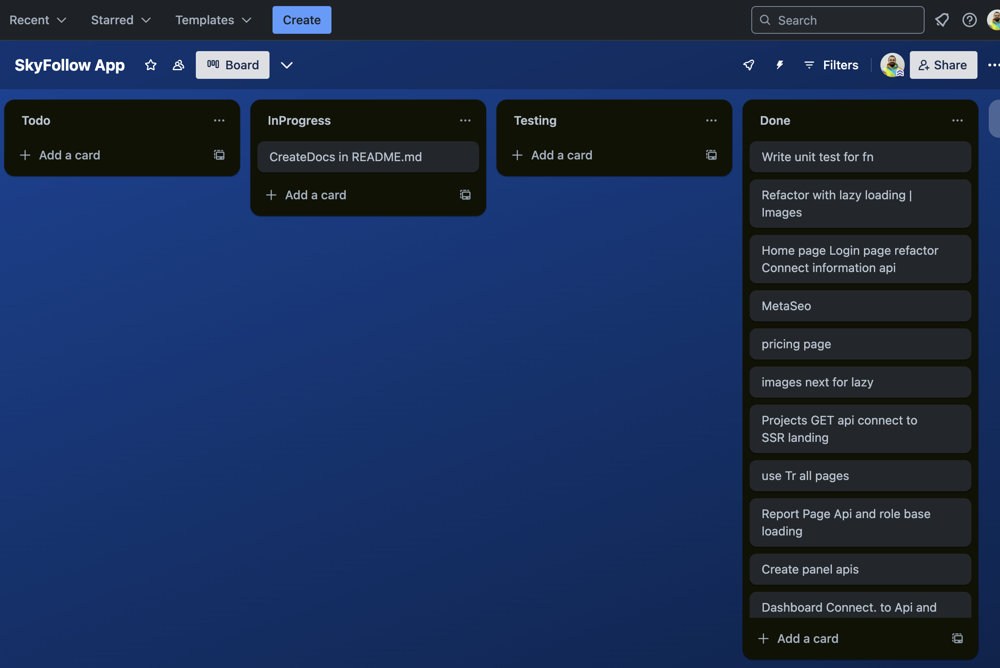
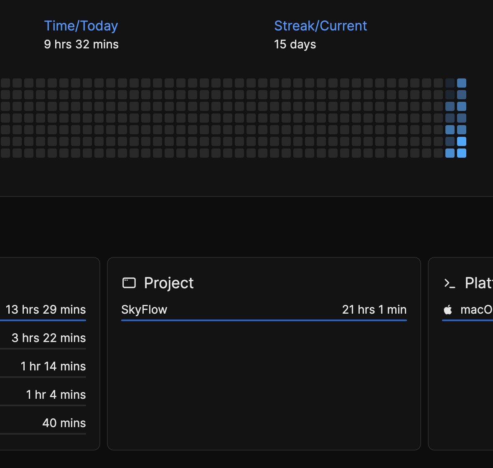
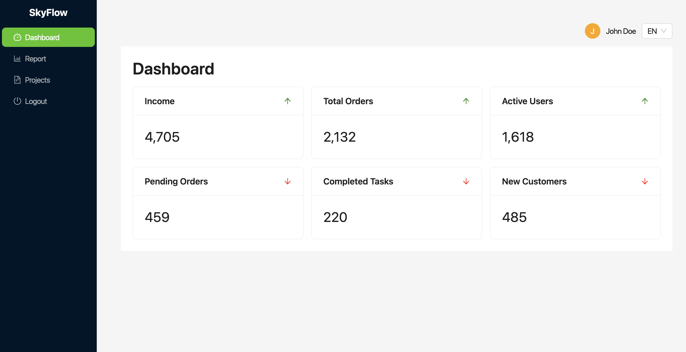

# SkyFlow App - Cloud-powered workflow management

## Overview

SkyFlow is a powerful cloud-based Software as a Service (SaaS) platform designed to provide businesses with a user-friendly dashboard for managing their data and resources. The User Dashboard module allows users to access various data, track performance, and perform actions based on their subscription plan.

## Production

SkyFlow - https://skyflow.sarkhanrahimli.dev

## Installation

1. Clone the repository:

```bash
git clone https://github.com/rahimlisarkhan/SkyFlow.git

cd SkyFlow

npm i

npm run dev

/* 'npm run test' for checking some **.test.tsx  components */
```

## Process & Features

- **Authentication & Authorization**

  - Secure login page with Rest API authentication service. Created and deployed
  - Project has Pricing, 404, Login,Panel pages. Good way for you when login the app
  - Created and deployed NodeJS backend project for all process with ROLES. Postman link with response examples - https://warped-escape-49769.postman.co/workspace/Onlearn~7a11dc95-be64-4bb4-b579-db5727ec6ce0/collection/34865402-043d7954-f2ee-4b57-971f-43bfff79d2ef?action=share&creator=34865402&active-environment=34865402-d534e20b-8ed0-49c7-a576-0be1dc5cf193

- **Plan-Based Access Control**

  - Created successful Role base data and used client side HOC,HOOK (e.g., Free, Pro, Enterprise).
  - Conditional rendering of dashboard COMPONENTS and ROUTING based on user plan with **withRoleGuard(Component,[...roles])**
  - FREE - User only see **Dashboard** bar and also **4 items** (Server send which data is show user. Checking network or types in projects)
  - PRO - User see all section but user see only **1 chart in Reports** and **6 items** in Dashboard
  - ENTERPISE - User has access **all pages and also components** (You can check with acount credentials all process)
  - Accounts:

  ```bash
  FREE
  username:johndoe_free
  password:John4321%%

  PRO
  username:johndoe_pro
  password:John4321%%

  ENTERPRICE
  username:johndoe_enter
  password:John4321%%

  ```

  - Role examples: **withRoleGuard** - First checking user auth then if you has user checking roles and redirect user or login page. Used it everywhere for checking auth page but without home landing page.

  ```tsx
  function Reports() {
    const { t } = useTranslation('common');

    return (
      <PanelLayout>
        <MetaSeo title={t('report')} />
        <Title level={2}>{t('report')}</Title>
        <ReportsContent />
      </PanelLayout>
    );
  }

  export default withRoleGuard(Reports, [ROLES.PRO, ROLES.ENTERPRISE]);
  ```

  - Role examples: **useCheckRole** - It is hook. We need to render for component. This hook has 2 options use method.Just pass to roles and then look amazing proses. useCheckRole used Dashboard cards ,Report chart and Projects button

  ```tsx
  function ProjectsTable() {
    const checkRole = useCheckRole([ROLE.PRO, ROLE.ENTERPRISE]);

    return (
      <PanelLayout>
        {checkRole(
          <Button style={{ marginBottom: 14 }} onClick={handleCreate}>
            {t('create')} +
          </Button>
        )}
      </PanelLayout>
    );
  }

  export default ProjectsTable
  ```

- **Multi-Language Support (i18n)**

  - We has English and Azerbaijani language options.
  - Created custom hook and reusable component for change lang and use everywhere
  - Translated all pages with 404.

- **Code Quality & Performance**

  - Branches system - I was working branch every feature then PR to main branch for quality and strong work.
  - Task Board system - I was using trello for task management.Spilt task then work!
  - Smooth UI - With Ant Design.
  - Clean code structure - Used Atomic design pattern for strong oversaw projects.And also used Eslint for clean code
  - Performance optimizations - with lazy-loading and code-splitting.
    - Lazy-loading in all pages
    - Pagination-render items in Projects page native ant design logic
    - React hooks- useMemo, useCallback, memo() for un-necessary rendering
    - Debouching & Networking- without a lot un-necessary requests to server. Because stored data, I don't need repeat request (Checking step by step all pages)
  - SSR request - in the Home for SEO. and without panels request with SSR. Cause already user see
  - Bundle size - Checking bundle size without un-necessary imports and used "Suspense or dynamic import"
  - Unit tests - created for key functions and components to ensure stability.

- **Responsive Design**
  - I'll create responsive design in app. Because only I focused optimization and code spiting, best solution skills

## Technologies Used

- **React** / **Next.js** for building the SEO user interface.
- **Typescript** for strong type of data analyses and used.
- **react-i18next** for internationalization (i18n) support.
- **highcharts** for strong analyses CRM.
- **Axios** for HTTP requests and API interactions also use strong fetching system.
- **Docker** for created container for deploy project.
- **Formik** for strong form handler.
- **Eslint** for strong clean code.
- **Ant Design** for Beauty user interfaces.
- **REST API** for professional data fetching.
- **Redux Toolkit** for state management and also powerful data fetching analyses with THUNK.
- **Jest** and **React Testing Library** for unit and component tests.

## Task Board

-Board - https://trello.com/b/2wJ1Qahr/skyfollow



## Task Board

-Time management - https://codetime.dev -> connect vscode extention
-Project time - daily 9.3 hours total - 21 hours



## Project

-SkyFlow - https://skyflow.sarkhanrahimli.dev


# Thats All!
